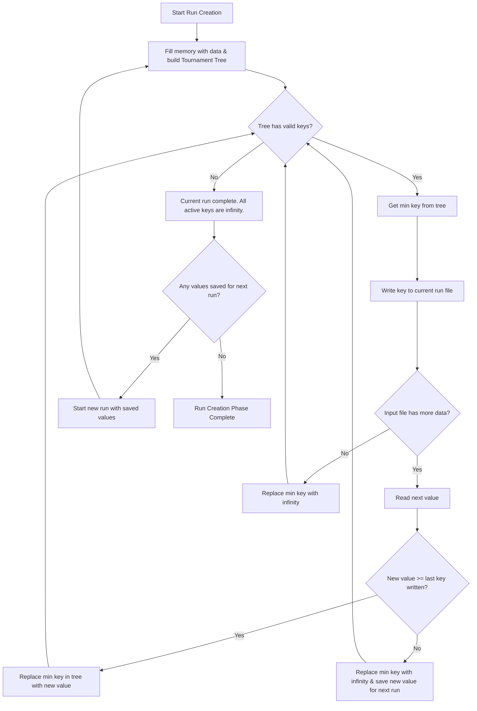
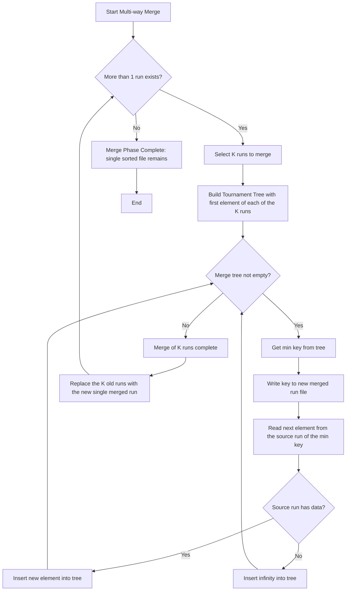
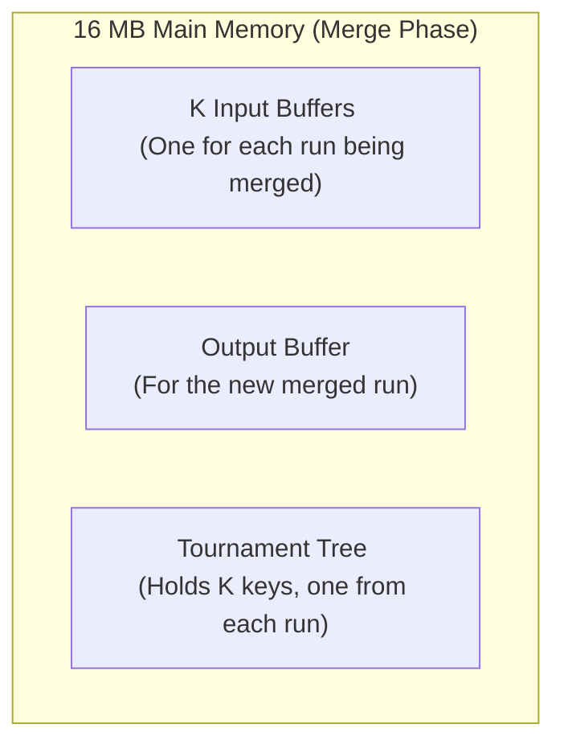

# External Merge Sort Algorithm

This document provides a high-level overview and flowchart for the external merge sort algorithm implemented in this project. This algorithm is particularly effective for sorting files that are too large to fit in memory.

## High-Level Explanation

The external merge sort process is divided into two main phases:

1.  **Run Creation Phase**: In this phase, the large input file is read sequentially, and a number of smaller, sorted files called "runs" are created on disk. To create the longest possible runs with the available memory, a **Tournament Tree** (a type of min-heap) and the **Replacement Selection** technique are used. The algorithm fills the available memory with data, builds a tournament tree, and repeatedly pulls the minimum value from the tree to write to the current run. As space frees up, new values are read from the input file. If a new value is larger than the last value written, it can be added to the tree for the current run; otherwise, it is held back for the _next_ run. This process continues until the entire input file has been processed into a set of sorted runs.

2.  **Multi-way Merge Phase**: After the initial runs are created, they must be merged into a single sorted file. This is done using a **K-way merge**. A small number (`K`) of runs are merged at a time. A tournament tree is again used to efficiently find the global minimum among the current elements from the `K` runs. The minimum element is written to a new, merged output file, and the next element from its source run is brought in for comparison. This process repeats until all `K` runs are merged. If there are still more than one run left on disk, the process repeats, merging the newly created merged runs. This continues in passes until only one, fully sorted file remains.

## Phase 1: Run Creation Flowchart

## Phase 2: Multi-way Merge Flowchart

## Memory Layout

During the **Multi-way Merge Phase**, the 16 MB of available RAM is partitioned to support the merging of `K` runs.

- **K Input Buffers**: To avoid excessive disk reads, a portion of memory is dedicated to a buffer for each of the `K` runs currently being merged.

- **Output Buffer**: A buffer to efficiently write the final merged output to a new run file on disk.

- **Tournament Tree**: A small but crucial data structure that holds the `K` candidate elements (one from each run) to quickly determine the overall minimum.
