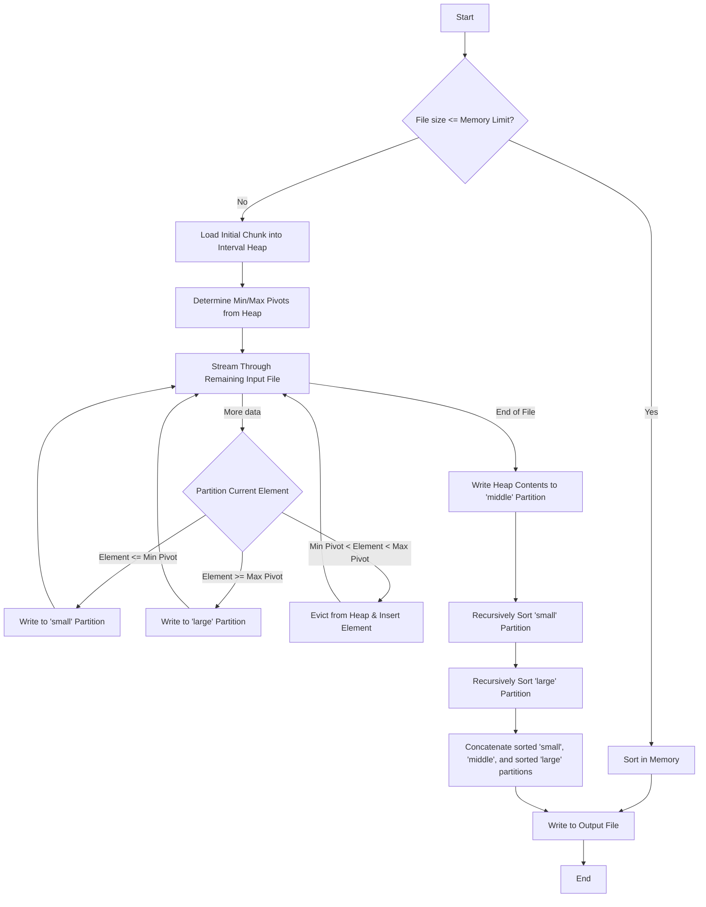
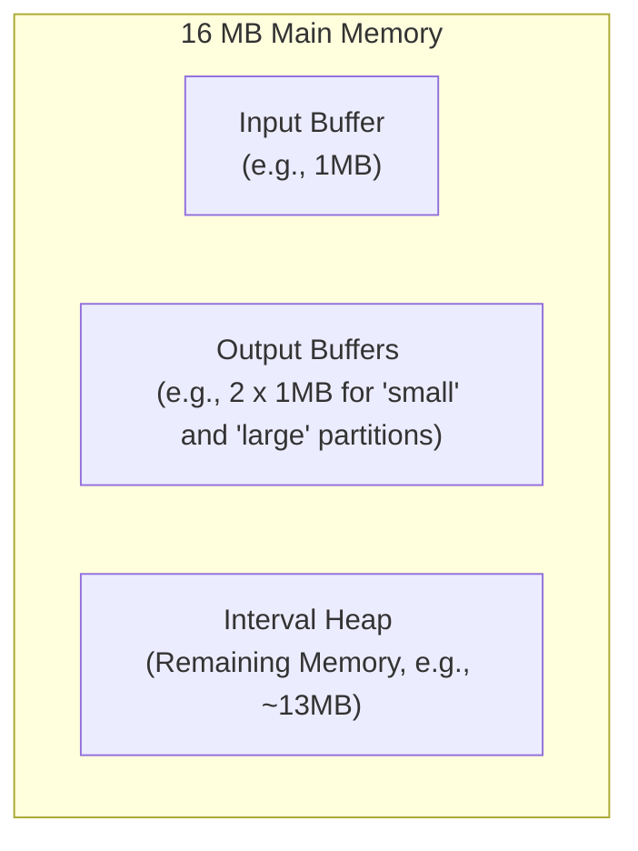

# External Quick Sort Algorithm

This document provides a high-level overview and flowchart for the external quick sort algorithm implemented in this project.

## High-Level Explanation

The goal of this algorithm is to sort a large file (e.g., 256 MB) that does not fit into the available internal memory (e.g., 16 MB). The implementation uses a three-way partitioning strategy based on a specialized in-memory data structure, the **Interval Heap**.

The core idea is as follows:

1.  **In-Memory Pivot Selection**: A portion of the file is loaded into an in-memory interval heap. This heap efficiently maintains a "middle group" of elements and provides the minimum and maximum values of this group, which serve as dynamic pivots (`min_pivot` and `max_pivot`).

2.  **Three-Way Partitioning**: The algorithm streams through the rest of the file on disk. For each number, it compares it to the current pivots from the interval heap:

    - If the number is smaller than or equal to `min_pivot`, it is written to a "small" partition file on disk.
    - If the number is larger than or equal to `max_pivot`, it is written to a "large" partition file on disk.
    - If the number falls between the pivots, it belongs in the middle group. To make space, an element is evicted from the interval heap (either the min or max, depending on the strategy) and written to the appropriate "small" or "large" partition. The new number is then inserted into the heap.

3.  **Recursion**: After the entire input file is processed, the interval heap's contents are written to a "middle" partition file on disk. This middle partition is now sorted. The algorithm then recursively calls itself on the "small" and "large" partition files.

4.  **Base Case**: The recursion stops when a partition is small enough to fit entirely within the allocated internal memory. At this point, it is sorted in-memory using a standard sorting algorithm (like `std::sort`).

5.  **Final Merge**: Once the recursive calls return, the final sorted file is produced by simply concatenating the sorted "small" partition, the sorted "middle" partition, and the sorted "large" partition in that order.

This approach effectively breaks down the massive sorting problem into smaller, manageable chunks that can be processed recursively.

## Algorithm Flowchart

## Memory Layout

The 16 MB of available RAM is partitioned to accommodate the data structures and buffers needed for the sorting process. The layout is approximately as follows:

- **Input Buffer**: A buffer to read chunks of the input file from disk efficiently.
- **Output Buffers**: Two buffers are used to write to the "small" and "large" partition files on disk.
- **Interval Heap**: The largest portion of the memory is allocated to the interval heap, which holds the pivot elements. The size of the heap directly impacts the quality of the pivots and the number of elements that need to be re-written to the small/large partitions.
